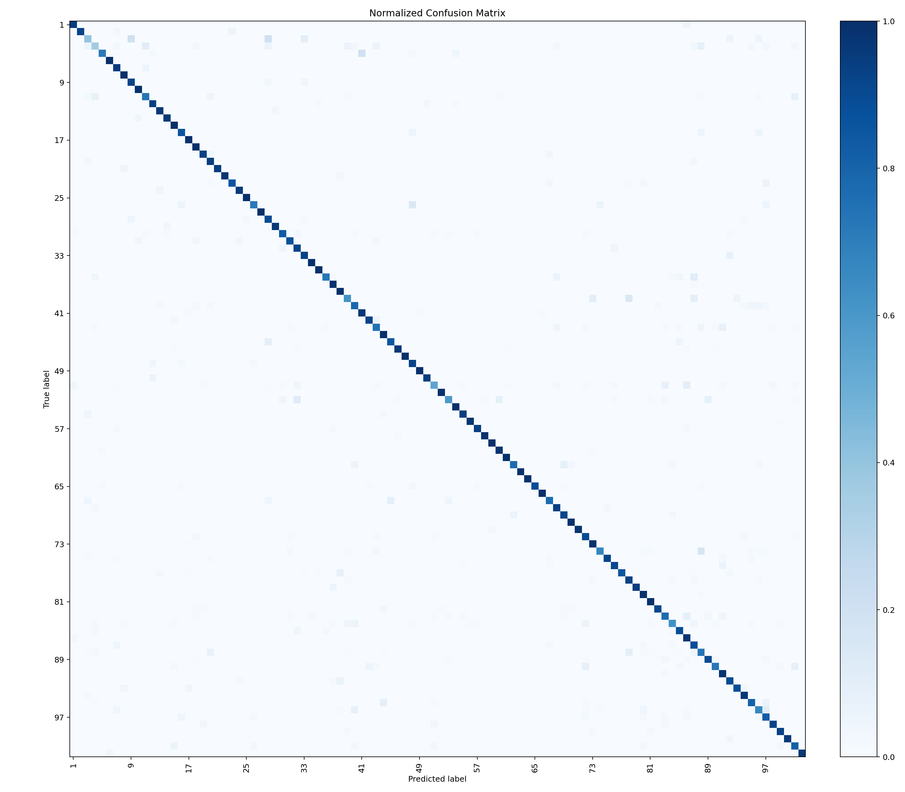
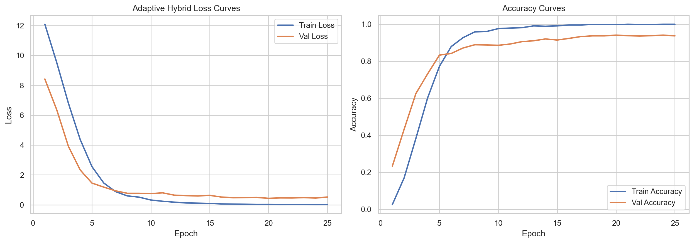
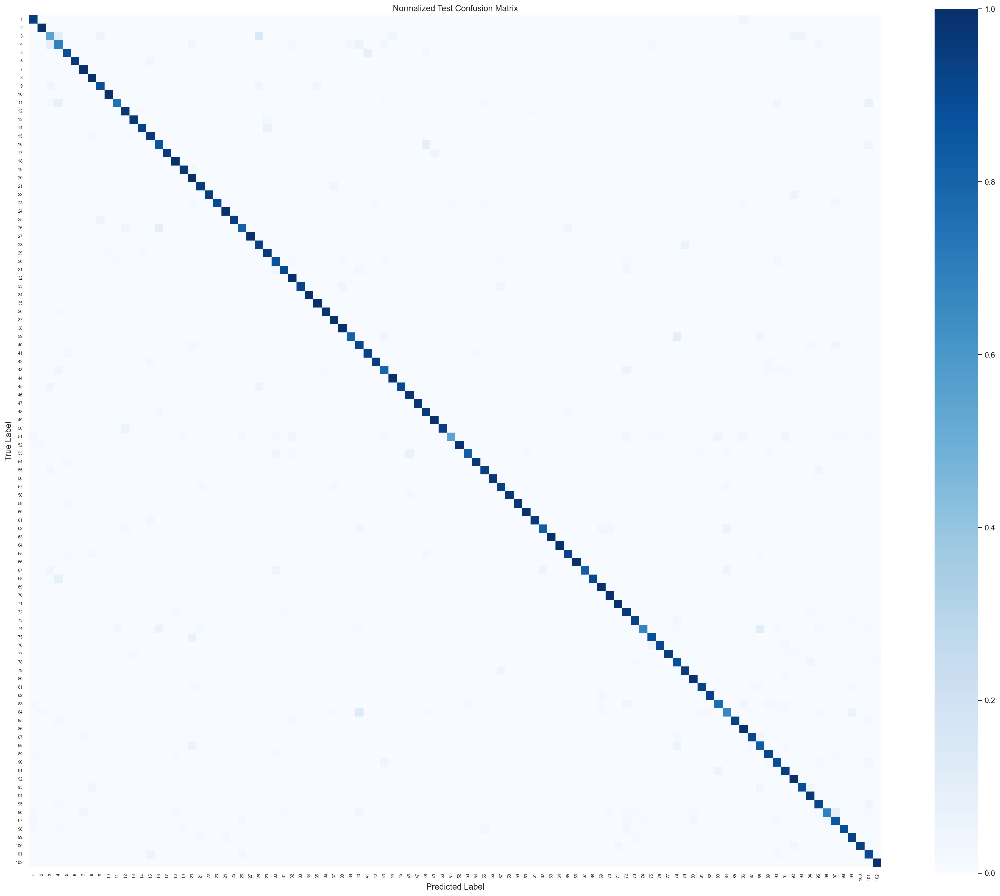
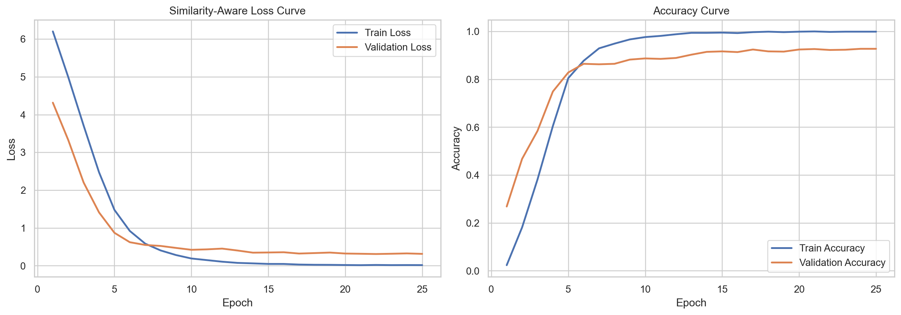
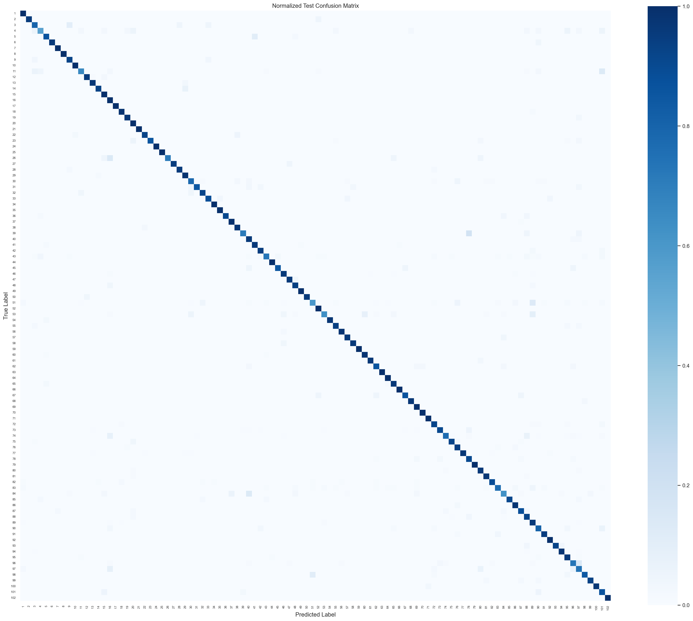
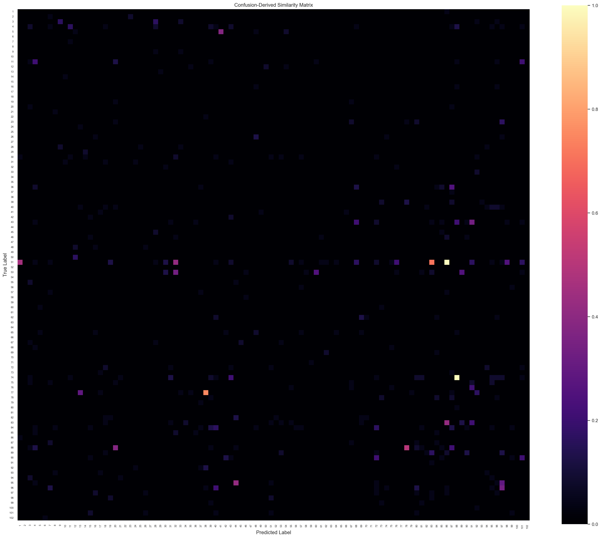

# Similarity-Aware Adaptive Loss for Fine-Grained Flower Classification

[](https://www.python.org/)
[](https://pytorch.org/)
[](https://www.robots.ox.ac.uk/~vgg/data/flowers/102/)
[](LICENSE)
[](#)

Research-oriented PyTorch implementation of fine-grained flower classification on **Oxford Flowers-102** using **InceptionV3** and a custom **Similarity-Aware Adaptive Loss** designed to penalize structured confusions more effectively than standard likelihood-based training alone.

## Abstract
Fine-grained image classification is challenging because visually similar categories often differ only in subtle local details while still exhibiting substantial intra-class variation. This repository studies the role of loss-function design in fine-grained flower recognition using Oxford Flowers-102. Starting from a Cross Entropy baseline, the project explored an entropy-aware adaptive objective to emphasize uncertain predictions. Although effective, that formulation introduced an important conceptual limitation: entropy may penalize uncertainty caused by noise or ambiguity rather than semantically meaningful class overlap. To address this, the final contribution of the project is a **Similarity-Aware Adaptive Loss** that uses a confusion-derived similarity matrix from the CE baseline to increase the penalty on difficult and historically confusing misclassifications. The resulting approach preserves the strengths of Cross Entropy while introducing structured confusion modeling tailored to fine-grained visual recognition.

## Motivation
Many flower species differ only in petal arrangement, minor texture cues, or subtle color distribution. Under such conditions:

- standard classification losses treat all errors too uniformly,
- uncertainty alone is not always a trustworthy signal of semantic difficulty,
- and structured inter-class confusion should be modeled explicitly.

This project investigates whether a lightweight objective-level intervention can improve fine-grained discrimination without replacing the backbone architecture.

## Problem Statement
Given an input image $x$ and a ground-truth label $y \in \{1,\dots,102\}$, learn a model that:

1. maximizes the probability of the correct flower species,
2. responds more strongly to semantically meaningful misclassifications,
3. reduces structured confusions among visually similar categories.

The central research question is:

> Can a confusion-structured similarity-aware adaptive loss improve fine-grained flower classification beyond standard Cross Entropy and an intermediate entropy-aware objective?

## Dataset
- **Dataset:** Oxford Flowers-102
- **Task:** Fine-grained flower species classification
- **Classes:** 102
- **Backbone:** InceptionV3 with ImageNet transfer learning
- **Primary hardware used in archived experiments:** NVIDIA GeForce RTX 4060 Laptop GPU

Archived split sizes used in this repository:

| Split | Images |
|---|---:|
| Train | 1,020 |
| Validation | 1,020 |
| Test | 6,149 |

The dataset folder is intentionally excluded from version control. See [data/README.md](data/README.md) for layout notes.

## Research Evolution
This repository captures the full evolution of the research idea rather than only the final result:

1. **Cross Entropy baseline** established the initial performance reference.
2. **Adaptive entropy-aware loss** was explored to emphasize uncertain predictions.
3. A weakness was identified: **entropy may penalize noise-induced uncertainty**, not just fine-grained semantic ambiguity.
4. Based on this limitation and professor feedback, the formulation was refined.
5. The project shifted toward **structured similarity-aware penalization** using class-pair confusion priors.
6. The final loss was implemented and evaluated against the previous stages.

This progression is central to the originality of the repository.

## Methodology
The experimental pipeline follows a staged research design:


The overall strategy is to preserve a strong transfer-learning backbone while improving the optimization objective.

## Architecture
The repository uses **InceptionV3** as the core image encoder and adapts the classification head for 102-way flower recognition.

### Backbone Characteristics
- pretrained on ImageNet
- strong multi-scale feature extraction
- suitable for fine-grained visual recognition
- computationally practical on RTX 4060 hardware

### Training Features Across Experiments
- transfer learning
- image normalization and augmentation
- optional mixed precision on CUDA
- gradient clipping in adaptive experiments
- early stopping
- Optuna-based hyperparameter optimization
- checkpointing and metrics export

## Similarity-Aware Loss Function
The final proposed objective is:

$$
\mathcal{L} = -\log(p_t)\left(1 + \lambda \, S(y,\hat{y}) \, (1-p_t) \, \mathbb{I}(\hat{y}\neq y)\right)
$$

where:

- $p_t$ is the probability assigned to the true class,
- $\hat{y}$ is the predicted class,
- $S(y,\hat{y})$ is a confusion-derived similarity weight,
- $(1-p_t)$ is a difficulty factor,
- $\mathbb{I}(\hat{y}\neq y)$ activates the adaptive term only for incorrect predictions,
- $\lambda$ controls the influence of structured penalization.

### Intuition
The loss behaves like standard Cross Entropy for correct predictions. For incorrect predictions, it selectively increases the penalty when:

1. the model is wrong,
2. the wrong prediction belongs to a historically confusing class,
3. the model assigns weak confidence to the true class.

This is particularly useful in fine-grained classification, where many errors cluster around visually similar species rather than being uniformly distributed.

## Mathematical Derivation

### 1. Softmax Posterior
For logits $\mathbf{z}\in\mathbb{R}^{K}$:

$$
p_k = \frac{\exp(z_k)}{\sum_{j=1}^{K}\exp(z_j)}
$$

and for the true class $y$:

$$
p_t = p_y
$$

In implementation, $p_t$ is clamped for numerical stability:

$$
p_t \leftarrow \mathrm{clip}(p_t,\varepsilon,1-\varepsilon), \qquad \varepsilon = 10^{-7}
$$

### 2. Cross Entropy Loss
The standard Cross Entropy objective is:

$$
\mathcal{L}_{CE} = -\log(p_t)
$$

#### Intuition
This maximizes the likelihood of the correct class. However, it does not distinguish between semantically meaningful confusions and arbitrary errors.

#### Gradient
For class $k$, the gradient with respect to the logit $z_k$ is:

$$
\frac{\partial \mathcal{L}_{CE}}{\partial z_k} = p_k - \mathbb{I}(k=y)
$$

This is the standard probabilistic classification gradient.

### 3. Focal Loss
For reference, focal loss introduces confidence-based reweighting:

$$
\mathcal{L}_{FL} = -(1-p_t)^\gamma \log(p_t)
$$

#### Intuition
Focal loss down-weights easy examples and emphasizes hard samples, especially when $p_t$ is low.

#### Gradient Sketch
Ignoring algebraic expansion details, the focal term scales the CE gradient by a confidence-dependent factor and adds an extra derivative through $(1-p_t)^\gamma$. This makes the gradient more aggressive on hard examples.

#### Why It Is Relevant Here
Focal loss is a natural comparator because it also emphasizes difficult predictions. However, it does not explicitly encode **which incorrect classes are structurally confusing**.

### 4. Difficulty Factor
The proposed method retains an adaptive notion of difficulty:

$$
D = 1 - p_t
$$

This quantity is small for confident correct predictions and large when the model struggles.

### 5. Predicted Class and Indicator
The predicted label is:

$$
\hat{y} = \arg\max_k p_k
$$

The indicator function is:

$$
\mathbb{I}(\hat{y}\neq y) =
\begin{cases}
1, & \hat{y}\neq y \\
0, & \hat{y}=y
\end{cases}
$$

This guarantees that the extra penalty is zero for correct predictions.

### 6. Similarity Matrix
The similarity matrix is derived from the CE baseline confusion matrix and captures empirical class-pair confusability:

$$
S(y,\hat{y}) \in [0,1]
$$

Let $C_{ij}$ denote the CE confusion count from true class $i$ to predicted class $j$:

$$
C_{ij} = \#\{(x,y): y=i,\ \hat{y}=j\}
$$

Then:

$$
C_{ii} \leftarrow 0 \qquad \forall i
$$

and the normalized similarity matrix is:

$$
S_{ij} =
\begin{cases}
0, & i=j \\
\dfrac{C_{ij}}{\max_{p\neq q} C_{pq}}, & i\neq j
\end{cases}
$$

### 7. Adaptive Weight
The similarity-aware adaptive weight is:

$$
W = 1 + \lambda \, S(y,\hat{y}) \, (1-p_t) \, \mathbb{I}(\hat{y}\neq y)
$$

#### Interpretation
- $1$ preserves the Cross Entropy base
- $S(y,\hat{y})$ emphasizes historically confusing flower pairs
- $(1-p_t)$ prioritizes difficult examples
- $\mathbb{I}(\hat{y}\neq y)$ avoids penalizing correct predictions

### 8. Final Proposed Loss
The final objective becomes:

$$
\mathcal{L} = \mathcal{L}_{CE} \cdot W
$$

or equivalently

$$
\mathcal{L} = -\log(p_t)\left(1 + \lambda \, S(y,\hat{y}) \, (1-p_t) \, \mathbb{I}(\hat{y}\neq y)\right)
$$

### 9. Gradient Discussion
The loss is fully differentiable through $p_t$, while $\hat{y}$ and the indicator term are piecewise-defined because they depend on $\arg\max$. In practice, the dominant gradient still flows through the log-likelihood and confidence-dependent components, which makes the loss trainable and numerically stable when combined with probability clipping.

## Experimental Setup

### Backbone and Framework
- PyTorch
- InceptionV3 with ImageNet initialization
- Oxford Flowers-102

### Optimization Features
- mixed precision for CUDA-enabled adaptive experiments
- gradient clipping
- early stopping
- cosine learning-rate scheduling
- checkpointing
- Optuna hyperparameter tuning

### Similarity-Aware Search Space
- $\lambda \in [0.01, 0.2]$
- learning rate $\in [10^{-5}, 10^{-3}]$ on log scale
- weight decay $\in [10^{-6}, 10^{-3}]$ on log scale

## Training Pipeline

### Public Unified Entrypoint
This repository now includes a unified training wrapper:

```bash
python train.py --experiment similarity
```

Supported experiments:
- `ce`
- `entropy`
- `similarity`

Examples:

```bash
python train.py --experiment ce
python train.py --experiment entropy --extra --profile full
python train.py --experiment similarity --extra --profile full
```

### Legacy Direct Commands
Cross Entropy baseline:

```bash
python main.py --mode train_eval
```

Entropy-aware adaptive loss:

```bash
python train_adaptive_loss.py --profile full
```

Similarity-aware adaptive loss:

```bash
python train_similarity_aware_loss.py --profile full
```

## Results

### Main Experimental Comparison

| Method | Validation Accuracy | Test Accuracy | Macro F1 | Weighted F1 |
|---|---:|---:|---:|---:|
| Cross Entropy baseline | 91.27 | 88.03% | 87.24% | 87.97% |
| Adaptive entropy-aware loss | 94.12% | 90.40% | 90.17% | 90.36% |
| Similarity-aware adaptive loss | 92.75% | 90.45% | 90.49% | 90.43% |

### Interpretation
- The similarity-aware method improves test accuracy by **+2.42 points** over the CE baseline.
- It improves macro F1 by **+3.25 points** over the CE baseline.
- Compared with the entropy-aware adaptive method, it delivers a modest but meaningful improvement on held-out test accuracy and macro F1, suggesting slightly better generalization.

## Comparison with Cross Entropy and Focal Loss

### Conceptual Comparison

| Loss | Hard-example emphasis | Structured class relationship modeling | Public archived experiment in this repo |
|---|---|---|---|
| Cross Entropy | No explicit emphasis | No | Yes |
| Focal Loss | Yes | No | Not yet |
| Similarity-Aware Adaptive Loss | Yes | Yes | Yes |

### Why Focal Loss Is Included in the Discussion
Focal loss is a strong reference point because it emphasizes difficult samples through confidence reweighting. The proposed method goes one step further by explicitly modeling whether the incorrect prediction corresponds to a historically confusing class pair.

### Current Limitation
A standalone focal-loss benchmark is not yet archived in this repository. It is listed as a priority future baseline rather than presented as a completed experiment.

## Ablation Study
This repository naturally supports a three-stage ablation narrative:

| Variant | Role in the study | Main observation |
|---|---|---|
| Cross Entropy | Baseline | Strong transfer-learning reference but no structured confusion modeling |
| Entropy-aware adaptive loss | Intermediate formulation | Improves performance but may over-penalize noise-induced uncertainty |
| Similarity-aware adaptive loss | Final proposed method | Preserves adaptive weighting while targeting semantically meaningful mistakes |

### Key Insight
The most important research conclusion is not only that the final method performs best on test data, but that it is **better aligned with the semantics of fine-grained recognition** than a global entropy penalty.

## Visualizations

### Cross Entropy Confusion Matrix


### Entropy-Aware Training Curves


### Entropy-Aware Confusion Matrix


### Similarity-Aware Training Curves


### Similarity-Aware Confusion Matrix


### Similarity Matrix Heatmap


### Suggested Future Visualizations
- Grad-CAM for class-discriminative localization
- t-SNE or UMAP embedding projections
- feature similarity heatmaps between confusing classes
- confidence calibration plots
- per-class confusion reduction charts

## Installation

### Pip
```bash
git clone https://github.com/TheegalaYeseswini/similarity-aware-flower-classification.git
cd similarity-aware-flower-classification
pip install -r requirements.txt
```

### Conda
```bash
conda env create -f environment.yml
conda activate similarity-aware-flower-classification
```

## Usage

### Summarize archived experiment results
```bash
python evaluate.py
```

### Print markdown-formatted result table
```bash
python evaluate.py --format markdown
```

### Run similarity-aware training
```bash
python train.py --experiment similarity --extra --profile full
```

## Reproducibility
The repository emphasizes script-based experimentation over notebook-only workflows.

For reproducible use:
- keep dataset structure consistent with the expected `flowers102/` layout
- preserve train/validation/test splits
- use the provided training scripts rather than ad hoc modifications
- record Optuna best parameters and exported metrics
- keep large datasets and checkpoints local rather than versioning them into Git

Additional reproducibility improvements that are still planned:
- config-driven experiments under `experiments/`
- explicit seed logging and environment capture
- automated artifact registry
- focal-loss baseline integration

## Repository Structure

```text
.
├── assets/
│   ├── figures/
│   └── README.md
├── data/
│   └── README.md
├── docs/
│   └── repository_audit.md
├── experiments/
│   └── README.md
├── models/
│   └── README.md
├── notebooks/
│   └── README.md
├── reports/
│   └── README.md
├── results/
│   ├── README.md
│   └── metrics_summary.md
├── src/
│   ├── __init__.py
│   └── reporting.py
├── CONTRIBUTING.md
├── LICENSE
├── README.md
├── environment.yml
├── evaluate.py
├── main.py
├── requirements.txt
├── train.py
├── train_adaptive_loss.py
└── train_similarity_aware_loss.py
```

Local-only folders such as dataset copies, checkpoints, logs, and caches are intentionally excluded from version control for a cleaner public release.

## Recommended Pre-Upload Cleanup
Before pushing publicly, keep the repository lightweight and research-focused:

### Exclude from Git
- `flowers102/`
- `checkpoints/`
- `checkpoints_adaptive_loss/`
- `checkpoints_similarity_loss/`
- `__pycache__/`
- large `.pth` files
- intermediate `.npy` artifacts used only for local experimentation
- training logs and temporary outputs

### Keep in Git
- core training scripts
- curated figures
- README
- license
- requirements
- selected report assets and publication-ready documentation

## Future Work
- standalone focal-loss baseline
- supervised contrastive learning
- prototype learning
- dynamic similarity matrices
- transformer backbones
- semantic embedding regularization
- self-supervised pretraining
- Grad-CAM and embedding-space interpretability
- transfer of structured confusion modeling to medical or plant-pathology imaging

## References
1. S. Nilsback and A. Zisserman, “Automated Flower Classification over a Large Number of Classes,” 2008.
2. C. Szegedy et al., “Rethinking the Inception Architecture for Computer Vision,” CVPR 2016.
3. T.-Y. Lin et al., “Focal Loss for Dense Object Detection,” ICCV 2017.
4. C. M. Bishop, *Pattern Recognition and Machine Learning*, Springer, 2006.
5. R. R. Selvaraju et al., “Grad-CAM: Visual Explanations from Deep Networks via Gradient-Based Localization,” ICCV 2017.

## Citation
If this repository is useful in research or technical work, please cite it as:

```bibtex
@misc{theegala2026similarityawareflowers,
  title        = {Similarity-Aware Adaptive Loss for Fine-Grained Flower Classification},
  author       = {Yeseswini Theegala and Aditya Chauhan and Harshit Patidhar},
  year         = {2026},
  note         = {Research-oriented PyTorch implementation on Oxford Flowers-102},
  howpublished = {\url{https://github.com/TheegalaYeseswini/similarity-aware-flower-classification}}
}
```

## License
This project is released under the [MIT License](LICENSE).
